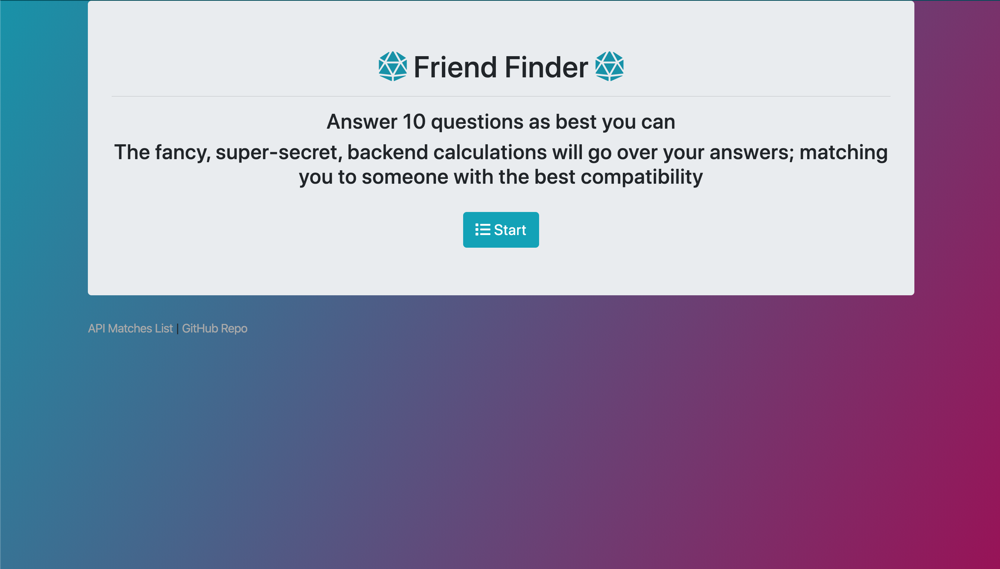
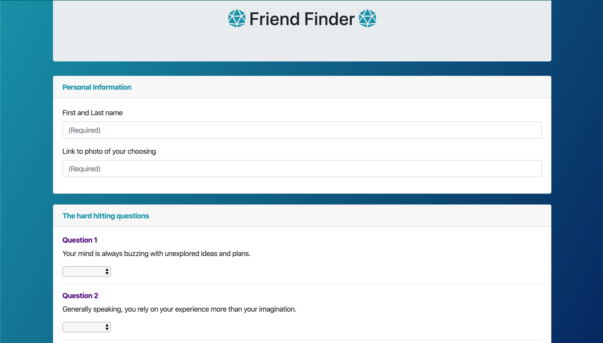
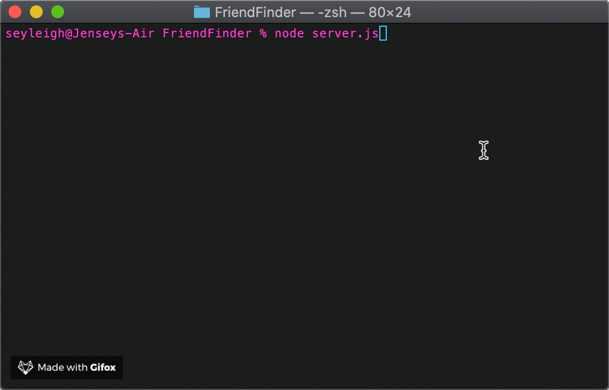

# BootcampTinder

This is an app that takes in a users choices for 10 different questions and calculates those answers and matches you to someone with answers closest to yours.

### Technologies used:
* Node.js
* Express
* Body Parser
* Sweet Alert
* Chalk Animation
* Bootstrap
* JQuery
---

[Link to Heroku](https:linkgoeshere.com)

---

